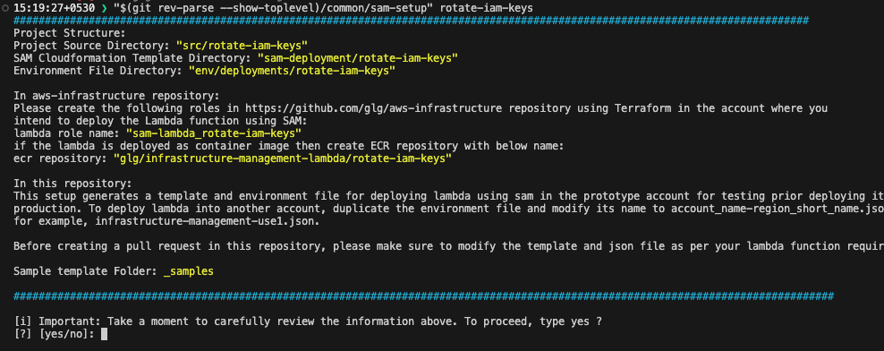

[](../../../actions/workflows/unit-test.yml)

# `terraform-aws-sam-lambda-essentials`

This module cerates lambda function role and ECR repository for SAM lambda deployed using **[infrastructure-management-lambda](https://github.com/glg/infrastructure-management-lambda)** .

## Usage

Name of the roles and repository will be given by the script while onboarding the lambda function to **[infrastructure-management-lambda](https://github.com/glg/infrastructure-management-lambda)**
Example:



```bash
module "target" {
  source = "../../"
  providers = {
    aws.primary = aws.prototype_use1
  }
  name                 = "${sam-project-name}"
  artifact_bucket_name = "${artifact_bucket_name}}"
  ecr_repository_name  = "${ecr_repository_name}"
}

# Add the other required policy to the lambda role. 
resource "aws_iam_role_policy" "lambda" {
  provider = aws.prototype_use1
  name     = "GetSpaceliftSumoApiKey"
  role     = module.target.lambda_role.lambda_role_name
  policy = jsonencode({
    "Version" : "2012-10-17",
    "Statement" : {
      "Effect" : "Allow",
      "Action" : [
        "secretsmanager:GetSecretValue"
      ]
      "Resource" : [
        "arn:aws:secretsmanager:${data.aws_region.current.name}:${data.aws_caller_identity.current.account_id}:secret:${local.secret_name}-??????"
      ]
    }
  })
}

output "all" {
  value = module.target
}
```

## Testing Overview

To better understand some of the terminology, I highly recommend at least reading over [this blog post](https://www.hashicorp.com/blog/testing-hashicorp-terraform) explaining some of the basic terraform test concepts, such as what a **unit test** is.

Our current system is focused on the following.

- Local **Unit Tests**

  These use the *currently installed version* of Terraform, and do a basic sanity on the module to make sure it would run at all.
- Automated **Unit Tests** via GitHub actions.

  These are fired automatically on commit to GitHub, but can also be executed locally.  They run against a matrix of Terraform versions to make establish that versions of Terraform this module could support.
- Locally initiated **Integration Tests**.

## 1. Local Unit Tests

- Uses locally installed `terraform` to validate `.tf` files.
- DOES NOT create any resources

### Requirements

- Terraform

### Steps

```bash
make unit-test
```

## 2. Local Automated Unit Tests

- Run the Unit Tests via the GitHub action locally.

### Requirements

- Terraform
- [nektos/act](https://github.com/nektos/act)

### Steps

```bash
# a module with only public or no dependencies on other modules
make action

# if you need to test a module with private dependencies
export TF_TESTABLE_MODULE_SSH_KEY=$(</path/to/ssh/key/with/github/access)
make action
```

## 3. Locally Initiated Integration Tests

### Full Test

The test is a basic `terraform init/apply/destroy` using local state.

```bash
# provide environment variables for the AWS provider
# , then run...
make full-test
```

### Partial Test

When iterating on code, it can sometimes be useful not to destroy.  In that case, just call the individual operations.

```bash
# if you want to just run a plan
make plan
# create/update the resources
make apply
# do more dev
make apply
# ... (repeat until done)

# destroy only
make destroy
```


<!-- BEGIN_TF_DOCS -->
## Requirements

| Name | Version |
|------|---------|
| terraform | >= 1.0 |
| aws | >= 4.27 |

## Providers

| Name | Version |
|------|---------|
| aws.primary | >= 4.27 |

## Modules

No modules.

## Resources

| Name | Type |
|------|------|
| [aws_ecr_repository.this](https://registry.terraform.io/providers/hashicorp/aws/latest/docs/resources/ecr_repository) | resource |
| [aws_ecr_repository_policy.this](https://registry.terraform.io/providers/hashicorp/aws/latest/docs/resources/ecr_repository_policy) | resource |
| [aws_iam_role.lambda](https://registry.terraform.io/providers/hashicorp/aws/latest/docs/resources/iam_role) | resource |
| [aws_iam_role_policy_attachment.lambda](https://registry.terraform.io/providers/hashicorp/aws/latest/docs/resources/iam_role_policy_attachment) | resource |
| [aws_caller_identity.current](https://registry.terraform.io/providers/hashicorp/aws/latest/docs/data-sources/caller_identity) | data source |
| [aws_partition.current](https://registry.terraform.io/providers/hashicorp/aws/latest/docs/data-sources/partition) | data source |
| [aws_region.current](https://registry.terraform.io/providers/hashicorp/aws/latest/docs/data-sources/region) | data source |

## Inputs

| Name | Description | Type | Default | Required |
|------|-------------|------|---------|:--------:|
| artifact\_bucket\_name | Cloudformation template backup bucket name | `string` | n/a | yes |
| ecr\_repository\_name | ECR repository to keep the lambda image | `string` | n/a | yes |
| name | 'name' will at least in part be assigned to most resources | `string` | n/a | yes |

## Outputs

| Name | Description |
|------|-------------|
| aws | n/a |
| ecr\_repository | n/a |
| lambda\_role | n/a |
<!-- END_TF_DOCS -->
